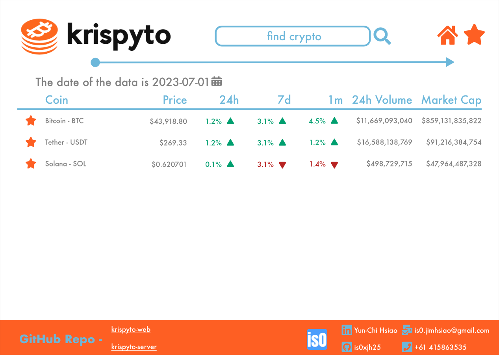
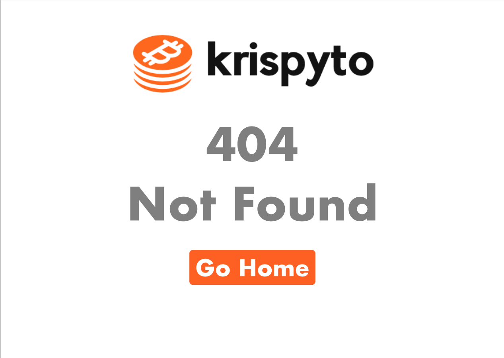

# Krispyto's Web
<p align="left">
  
  
## Table of Contents
* [Overview](#overview)
* [Design](#design)
* [Development and Technologies](#development-and-technologies)
* [Deployment](#deployment)
* [Developed By](#developed-by)
  
## Overview
Hello and welcome to the frontend repository of the Krispyto project! Here, you'll find the client-side implementation of our crypto price analysis application. Developed using ReactJS, the frontend offers an intuitive interface for exploring historical crypto prices and associated data. The deployment is handled seamlessly through Amazon Web Services (AWS). This readme document will showcase the initial design, development, and deployment phases of the project. Feel free to utilize the following links to navigate both the website itself and the repository for the backend server.
> - _[Krispyto's Website](http://13.239.27.73:3000)_
> - _[Krispyto's Server](https://github.com/is0xjh25/krispyto-server)_
  
## Design
 ### 1. Note
   - **Tool =>** The website is crafted using Figma and encompasses four main pages: the _Dashboard_, _Favorite_, _Single Currency_, and a _404 Not Found_ page. If you'd like to explore the design file, just [click here](https://www.figma.com/file/Nk8HuIRgLCIWWd8EhKHhVg/v1.0.0?type=design&node-id=0%3A1&mode=design&t=iyEJK4asJd0YfpxR-1).
   - **Font =>** Futura
   - **Color Palette =>** The color palette features Pantone Orange (#FD671E) as the primary design and favicon color, complemented by Sky Blue (#78C0E0) as the secondary hue. Pure Black is exclusively used for the font, while Fire Brick (#BF2424) communicates price drops and Jade (#00A878) indicates price rises. This thoughtful selection of colors enhances the visual representation across the website.
  <p align="center">
    
  </p>
  
 ### 2. Demo
 - **Dashboard <-> Favourite**
<p align="center">
  
  
</p>

- **Crypto Currency <-> 404 NOT FOUND**
<p align="center">
  
  
</p>

## Development and Technologies
  ### 1. Functionalities
  - Home Page (Dashboard):
    - Displays crypto history data based on the chosen day from the Datepicker.
    - Default date is set to 2021-06-07, the latest date in the database.
    - Header row is clickable, and data can be ordered by specific metrics.
    - Provides filtering options for the latest 7 days, 24 hours, and 1 month.
    - Allows ascending or descending order by clicking the same metric consecutively.
    - Clickable rows redirect to specific crypto information pages.
  
  - Crypto Page:
    - Designed to showcase recent info, charts, and statistics for a single currency.
    - Originally used CoinGecko for widgets, but unstable plugin removed.

- Navbar:
  - Includes a search bar for searching crypto by symbol or name.
  - Redirects to the corresponding crypto page.
  - Home button returns to the dashboard.

- Footer
  - Contains contact information.

- Responsive Design
  - User-friendly on various devices, considering different screen sizes.

- Snackbar
  - Provides notifications for actions.
  - For example, displays an error message if a chosen date has no data.
  - Warns with a yellow notification if the search bar is empty during a search.

### 2. Language and Framework
- **Programming Language =>** JavaScript
- **Framework =>** ReactJS

### 3. Library and Plugin
- **FontAwesome =>**
  Utilized for a diverse set of icons in the application.

- **CoinGecko =>**
  Originally used for providing a free widget with crypto finance information.

- **Material UI =>**
  Implemented for a user-friendly datepicker component.

- **Notistack =>**
  Integrated for displaying notifications in the form of snackbars.

### 4. Setting up the Development Environment
1. Create a `.env` file in the project's root directory.
2. Add the following line to the `.env` file:
```dotenv
REACT_APP_API_URL="api_server_ip_address"
```
> Note: This configuration is removed during the image-building process, ensuring flexibility to change the IP address of the API server when needed.

> To run the Docker container with the specified environment variable:<br> `> docker run -p 3000:3000 -e REACT_APP_API_URL=http://3.107.0.250:8000 krispyto-web`

## Deployment
  ### 1. AWS
   I leverage _[AWS Fargate](https://aws.amazon.com/fargate/)_, a serverless compute engine for containers, compatible with both _[Amazon Elastic Container Service (ECS)](https://aws.amazon.com/ecs/)_. I create the Dockerfile locally, push the image to the [Amazon Elastic Container Registry](https://aws.amazon.com/ecr/) using AWS CLI, and set up the service. This ensures both the API server and the frontend web server can be accessed publicly. For detailed instructions, refer to the article ["Deploying a Docker container with ECS and Fargate"](https://aws.plainenglish.io/deploying-a-docker-container-in-aws-using-fargate-5a19a140b018) by Esteban.
   > Now, you can visit the deployed website which hosted on http://13.239.27.73:3000
  ### 2. Docker
  Place the Docker file in the same directory and execute the following command.
  ```shell
  > docker build -t krispyto-web .  # Builds a Docker image with the tag "krispyto-web."
  > docker run -p 3000:3000 --env-file ./.env  # Runs a Docker container, mapping port 3000 and using environment variables from ".env."
  ```
  ```dockerfile
  # dockerfile

  # Fetching the latest node image on alpine linux
  FROM node:alpine
  
  # Setting up the work directory
  WORKDIR /krispyto-web
  
  # Installing dependencies
  COPY ./package*.json /krispyto-web
  
  RUN npm install
  
  # Copying all the files in our project
  COPY . .
  
  EXPOSE 3000
  
  # Starting our application
  CMD ["npm","start","--host","0.0.0.0","--port","3000"]
  ```
  
## Developed By
- The application is developed by _[is0xjh25 (Yun-Chi Hsiao)](https://is0xjh25.github.io)_.
- Special thanks to the _[Greythorn Team](https://greythorn.com)_ for providing this coding challenge and their guidance throughout the development process.
- Special gratitude goes to _[CoinGecko](https://www.coingecko.com)_ for providing a free widget that enhances the application's functionality.
<br/>
<p align="left">
  
